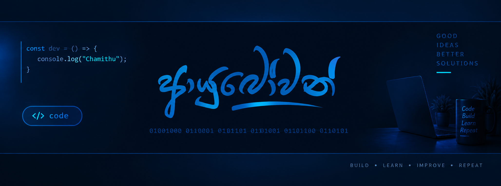

  

 
 

<h2 align="center">Web Developer & ERP System Builder</h2>

  <a href="https://chamithuds.github.io/">Portfolio</a>
  &nbsp; • &nbsp;
  <a href="https://chamithu-erp-demo.site.je/auth/login.php">ERP Demo</a>
  &nbsp; • &nbsp;
  <a href="https://github.com/chamithuds">GitHub</a>

  Building, learning and improving through practical projects from Sri Lanka 🇱🇰

 
<h3 align="center">Most Used Languages</h3>

  
  
  
  
  

